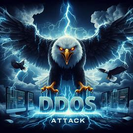
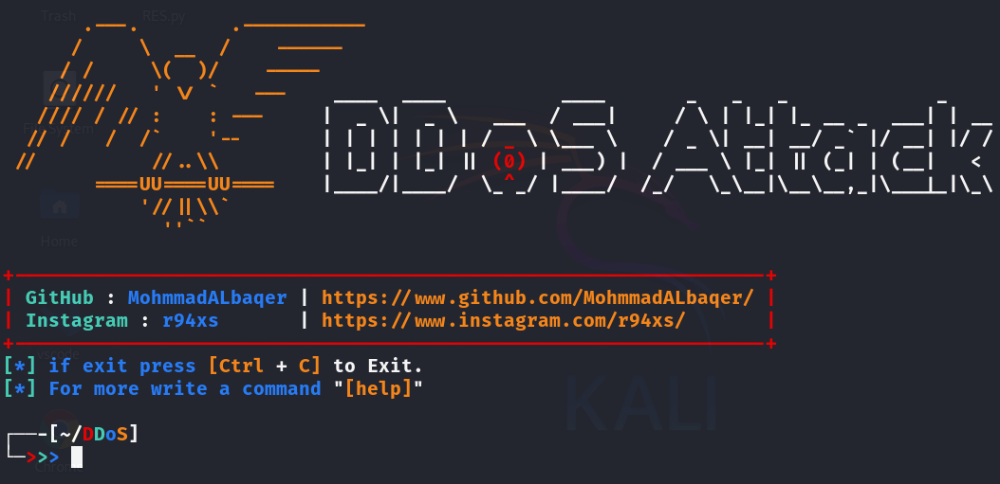
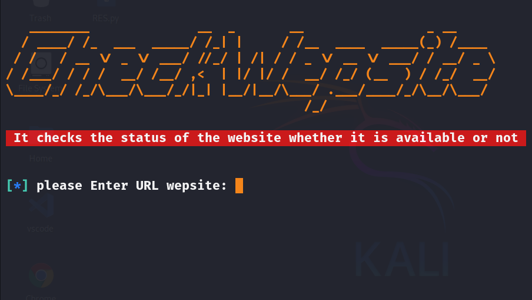

### Interface

```
                                                                                                                                                                      
       .---.        .-----------                                                                                                                                      
      /     \  __  /    ------                                                                                                                                        
     / /     \(  )/    -----                                                                                                                                          
    //////   ' \/ `   ---    ____  ____          ____       _   _   _             _                                                                                   
   //// / // :    : ---     |  _ \|  _ \   ___  / ___|     / \ | |_| |_ __ _  ___| | __                                                                               
  // /   /  /`    '--       | | | | | | | / _ \ \___ \    / _ \| __| __/ _` |/ __| |/ /                                                                               
 //          //..\\         | |_| | |_| || (0) | ___) |  / ___ \ |_| || (_| | (__|   <                                                                                
        ====UU====UU====    |____/|____/  \_^_/ |____/  /_/   \_\__|\__\__,_|\___|_|\_\                                                                               
            '//||\\`                                                                                                                                                  
              ''``    
```


### help OR options

```
             ,----------------,              ,---------,
        ,-----------------------,          ,"        ,"|
      ,"                      ,"|        ,"        ,"  |
     +-----------------------+  |      ,"        ,"    |
     |  .-----------------.  |  |     +---------+      |
     |  |  OPTIONS        |  |  |     | -==----'|      |
     |  |  [+] DNS        |  |  |     |         |      |
     |  |  [+] cf         |  |  |/----|`---=    |      |
     |  |  [+] HTTP       |  |  |     |         |      |
     |  |  [+] socks      |  |  |   ,/|==== ooo |      ;
     |  |  [+] TS3        |  |  |  // |(((( [33]|    ,"
     |  `-----------------'  |," .;'| |((((     |  ,"
     +-----------------------+  ;;  | |         |,"
        /_)______________(_/  //'   | +---------+
   ___________________________/___  `,
  /  oooooooooooooooo  .o.  oooo /,   \,"-----------
 / ==ooooooooooooooo==.o.  ooo= //   ,`\--{)B     ,"
/_==__==========__==_ooo__ooo=_/'   /___________,"
`-----------------------------'
```


### Options Explanation
```
1- HTTP (Hyper Text Transfer Protocol)
    - This type of attack involves increasing the volume of requests sent to web servers.
    The goal is to increase the pressure on the server so that it becomes unable to process all incoming requests, which leads to service disruption and the attack is unencrypted and without bypassing protection.

2- Socks
    - Depends on increased traffic across the Socks network.
    - It can be used to cause excessive pressure on the network or to bypass security restrictions that prevent access to certain sites.
    - The attack requires the site's IP in order for the attack to be completed.

3- CF (CloudFlare)
    - Aims to overwhelm web security services like CloudFlare.
    - It is used to manipulate security, take advantage of weaknesses in protection systems, and bypass protection.

4- TS3 (Team Speak 3)
    - An increase in the volume of traffic or connection requests to the TeamSpeak 3 servers.
    - The goal is to exhaust the server and disable the voice chat service.

5- DNS (Domain Name System)
    - It is used to increase traffic volume using DNS servers.
    - Manipulates DNS servers to send inflated answers to target IP addresses, increasing the attack size and disrupting the targeted service.
```


### Installation (Linux)

```
$ git clone https://github.com/MohmmadALbaqer/DDoSAttack.git
$ cd DDoSAttack
$ pip3 install -r requirements.txt
$ bash activation.sh
$ sudo python3 DDoSAttack.py
```


### Chack wep site targer
```
$ python3 chack.py
```

### SCREEN SHOT






## [~] Find Me on :

- [](https://github.com/MohmmadALbaqer)


- [](https://instagram.com/r94xs)

