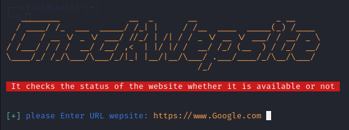

### Interface

```
       .---.        .-----------
      /     \  __  /    ------
     / /     \(  )/    -----
    //////   ' \/ `   ---
   //// / // :    : ---
  // /   /  /`    \'--
 //          //..\\
        ====UU====UU====
            '//||\\`
              ''``
·▄▄▄▄  ·▄▄▄▄        .▄▄ ·    ▄▄▄· ▄▄▄▄▄▄▄▄▄▄ ▄▄▄·  ▄▄· ▄ •▄ 
██· ██ ██· ██  ▄█▀▄ ▐█ ▀.   ▐█ ▀█ •██  •██  ▐█ ▀█ ▐█ ▌▪█▌▄▌▪
▐█▪ ▐█▌▐█▪ ▐█▌▐█▌.▐▌▄▀▀▀█▄  ▄█▀▀█  ▐█.▪ ▐█.▪▄█▀▀█ ██ ▄▄▐▀▀▄·
██. ██ ██. ██ ▐█▌.▐▌▐█▄▪▐█  ▐█▪ ▐▌ ▐█▌· ▐█▌·▐█▪ ▐▌▐███▌▐█.█▌
▀▀▀▀▀• ▀▀▀▀▀•  ▀█▄▀▪ ▀▀▀▀    ▀  ▀  ▀▀▀  ▀▀▀  ▀  ▀ ·▀▀▀ ·▀  ▀

```


### Installation (Linux)

```
$ git clone https://github.com/MohmmadALbaqer/DDoSAttack.git
$ cd DDoSAttack
$ pip3 install -r requirements.txt
$ python3 install.py
$ python3 DDoSAttack.py

```


### Chack wep site targer
```
$ python3 Chack.py
```


### SCREEN SHOT




### Know about a tool DDoS Attack
```
$ python3 About.py
```

## [~] Find Me on :

- [](https://github.com/MohmmadALbaqer)


- [](https://instagram.com/r94xs)

